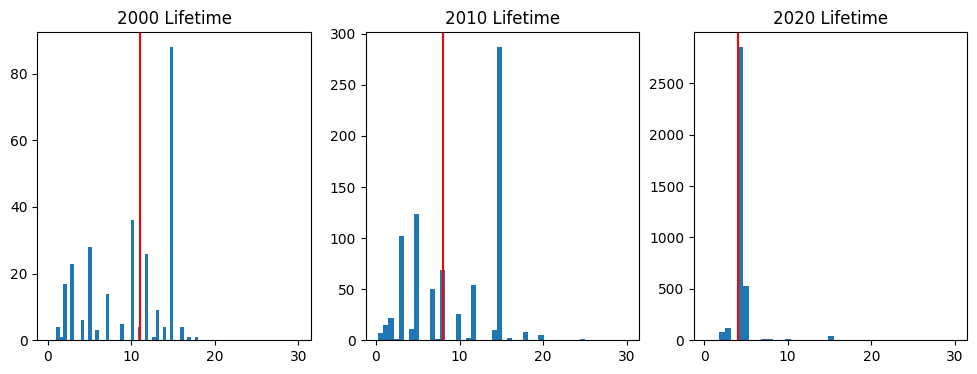
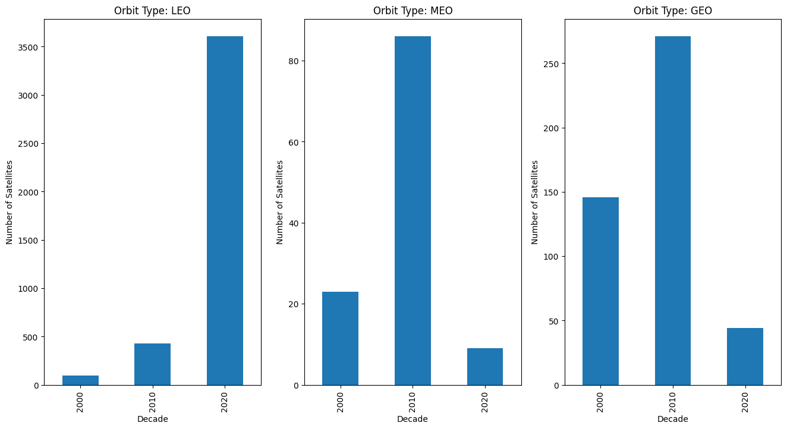
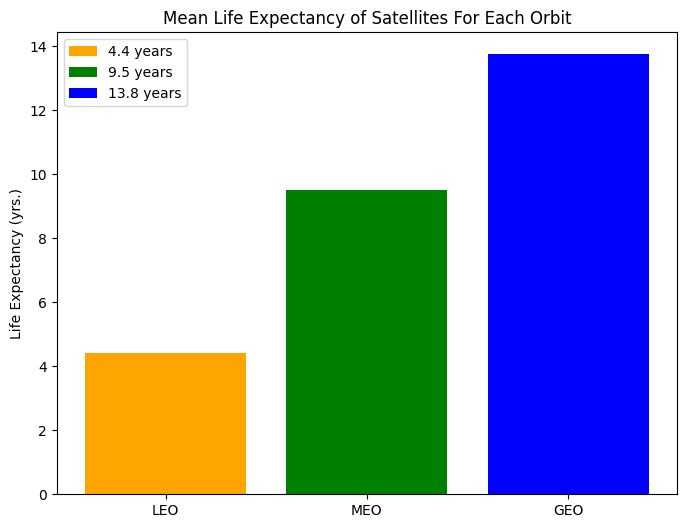
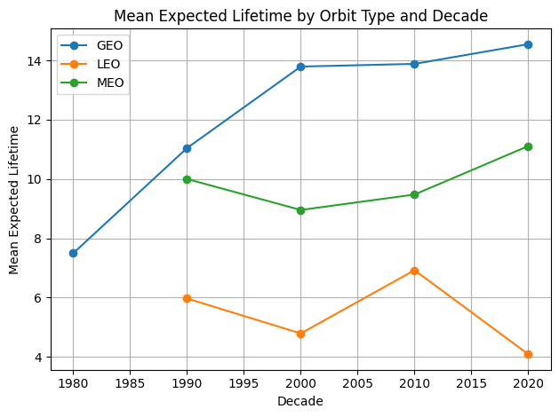
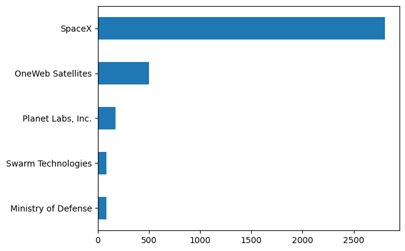

# Satellite Life Expectancies

## Overview
There are many different vital services services that satellites provide. 

## Question and Hypothesis
- Has the expected lifetime of satellites increased over the years?
- What are some of the factors that are affecting the expected lifetime of satellites?

## Cleaning
When originally importing this dataset, there were many columns that were missing too much data or entirely empty. With these columns removed I lookec to the columns I decided to look towards cleaning up the columns I decided to keep. With the missing values for my Expected Lifetime column I noticed that all the values were rounded to whole numbers and there were very few outliers. With that information I decided to use the median to fill in the missing data in order to keep my values consistent. Seeing how that this was the only numerical column I used, I looked at my categorical columns to fill in the missing data with 'Unknowns'. This allowed me to map the columns in order to make comparisions using my model. Seeing how I was going to be separating the satellites by decade, I used the 'Launch Date' column to create my 'Decade' column to group my data. After adding the mapping columns for each of my categorical columns I was ready to start my analysis.

## Visualization
 Starting off with a surface level analysis of the 'Life Expectancy' we can see the vast difference between the  2000's mean and the 2020's mean with the average dropping from 10.8 years to 4.8 years. We can also see the huge increase in satellite launches with 2020-2022 dwarfing the amount of launches conducted from 2000-2019. Seeing how many launches there were I decided to breakdown those launches to see where they were being sent.
 

 
Looking at the data we can see that the majority of the satellites launched for the 2020's were into the LEO orbit. Looking at how heaviliy the data was skewed with LEO satellites I decided to look at the life expectancy of a satellite in each orbit.
 

 
There is a very clear distinction between the average life expectancy of a satellite and the orbit. Comparing this graph with the previous one we can start to understand why the average expected life expectancy dropped so drastically for the 2020's. From previous knowledge I know the reason why the average life expectancy for satelittes decreases as the orbit is closer to Earth is due to the fact that the Earth's gravitational pull being stronger with the closer the object is to Earth. This translates to satellites having to expend more propellant in order to maintain its orbit and once the propellant has been used up, the satellite can no longer manuever and either reenters Earth's atmoshpere or in the case of GEO satellites, sent to the graveyard.
 

 
Reviewing the change in life expectancy for each decade for each orbit there is a better picture. This shows how the life expectancy has been increasing for satellites in both for MEO and GEO while LEO has declined. This is very interesting especially when we look at the operator who has been launching the majority of the satellites.
 

 
Looking at this graph with the majority of the satellites have been from SpaceX and doing research outside of the data provided, a majority of SpaceX's launches have been smallsats for their Starlink Costellation: a communication constellation providing broadband internet across the globe. These smallsats are designed to have multiple satellites stored onto a single launch vehicle. This smaller size could mean there is less room for propellant but further outside research would have to be done.
 

 

## Conclusion
From the data we can see the life expectancy of satellites has drastically dropped since the 2000's. This is due in part to the massive amount of LEO satellites launched in the 2020's. With LEO satellites having a lower life expectancy, these launches absolutely tanked the overall average life expectancy but if the life expectancies were broken down by orbit, there was actually an increase in life expectancy for satellites in MEO and GEO. Doing outside research it was found that the reason why the LEO satellite life expectancy went down was due to the useage of smallsats which allow for multiple satellites to be housed in a launch vehicle but have a lower life expectancy than regular satellites. With this knowledge, an assumption can be made that the life expectancy of satelittes in GEO and LEO has increased while LEO went down due to the massive use of smallsats.

## Possible Future Data Exploration
With seeing the development of smallsats it would be interesting to see the change in the cost of satellites and if there is any correlation between the cost and life expectancy. While looking at outside research, I saw some sources rasing concern over the smallsats and the increase in the likelyhood of a collision. Looking at a datset of the number of collisions or close calls could be beneficial as to see whether this statement is true or not. 
